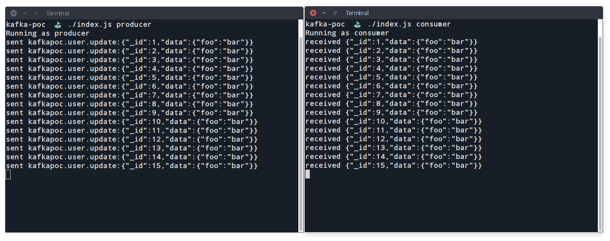

# Kafka POC

**Why:** To play around with Kafka and quick test scenarios to find out the fit for specific projects.

**What:** The idea is to have a quick example to tweak settings and quickly test scenarios.

---------------------------------



## Concepts

Learn more about Kafka: [kafka.apache.org](https://kafka.apache.org/)

Comparison with RabbitMQ: [pivotal.io/rabbitmq/understanding-when-to-use-rabbitmq-or-apache-kafka](https://content.pivotal.io/rabbitmq/understanding-when-to-use-rabbitmq-or-apache-kafka)

## Getting started / Prerequisites / Dependencies

First of all, make sure that you have a Kafka listening on `localhost:9092`. The easier way to do that is throught docker:

```
# Run kafka locally
docker run -p 2181:2181 -p 9092:9092 --env ADVERTISED_HOST=127.0.0.1 --env ADVERTISED_PORT=9092 spotify/kafka
```

Use the `./index.js <role> [topic]` as a entry point. Initialize multiple terminal instances in order to be able to see the message delivery.

```
# Run producer
./index producer kafkapoc.type.message

# (In a second terminal) run the consumer program
./index consumer kafkapoc.type.message
```

Fell free to run multiple consumers, stop, start services and play around with the code.
